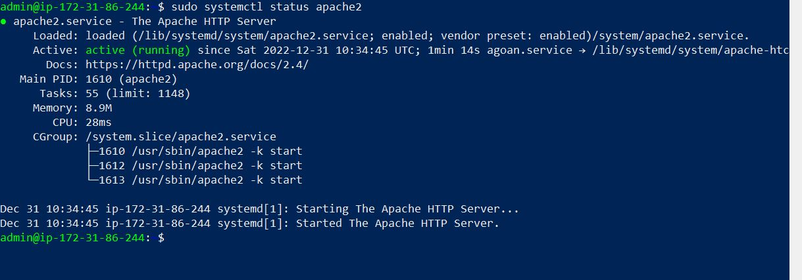

## Detailed Documentation of Project 1

'sudo apt update'

'sudo apt install apache2'

'sudo systemctl status apache2'

- [Install OpenSSH](https://learn.microsoft.com/en-us/windows-server/administration/openssh/openssh_install_firstuse?tabs=gui)

- [OpenSSH key management](https://learn.microsoft.com/en-us/windows-server/administration/openssh/openssh_keymanagement)