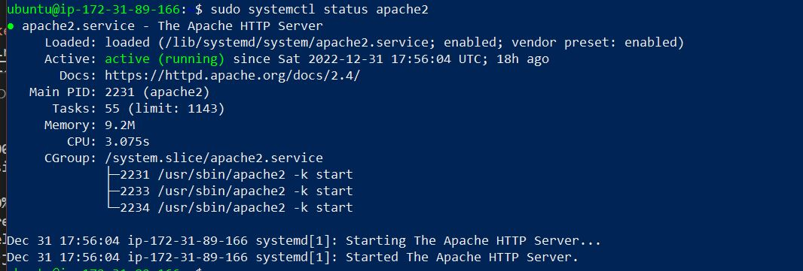

## Detailed Documentation of Project 1

For software installation, start with updating the local repository 

    'sudo apt update'

A. Install Apache

    'sudo apt install apache2'

Verify Status of Apache 

    'sudo systemctl status apache2'

Apache Homepage through http

B. MySql Installation 

    'sudo apt install mysql-server'

Verify MySql is installed

    'sudo mysql'

- To set password for the database root user

        'ALTER USER 'root'@'localhost' INDENTIFIED WITH mysql_native_password BY 'PassWord.1' ; 
- To validate passowrd plugin and restrict access and disable remote access

         'sudo mysql_secure_installation' 

C. Installing PHP

    'sudo apt install php libapache2-mod-php php-mysql'

Verify installation

D. Create Virtual Host

Make directory for projectlamp

        'sudo mkdir /var/www/projectlamp'

Assign ownership of directory with current user

    'sudo chown -R $USER:$USER /var/www/projectlamp'

Create a new configuration file for Virtual Host  in Apache's sites-available directory using 

    'sudo vi /etc/apache2/sites-available/ projectlamp.conf'

Use a2ensite to enable Virtual Host and using /var/www/projectlamp as web root directory

        'sudo a2ensite projectlamp'

Disabling the Apache default website
        
       ' sudo a2dissite 000-default' 

To check that configuration file does not contain errors

        'sudo apache2ctl configtest'

Reload Apache 

        'sudo systemctl reload apache2'

Creating index file in web root to test the virtual host

        'sudo echo 'Hello LAMP from hostname' $(curl -s http://169.254.169.254/latest/meta-data/public-hostname) 'with public IP' $(curl -s http://169.254.169.254/latest/meta-data/public-ipv4) > /var/www/projectlamp/index.html

Test result from browser

E. Enable PHP on the website
To enable index.php over index.html, edit dir.conf to change the order

    'sudo vim /etc/apache2/mods-enabled/dir.conf' 

Then reload apache

    'sudo systemctl reload apache2' 

Create index.php file

    'vim /var/www/projectlamp/index.php

And write 

Refresh the page to see index.php display

